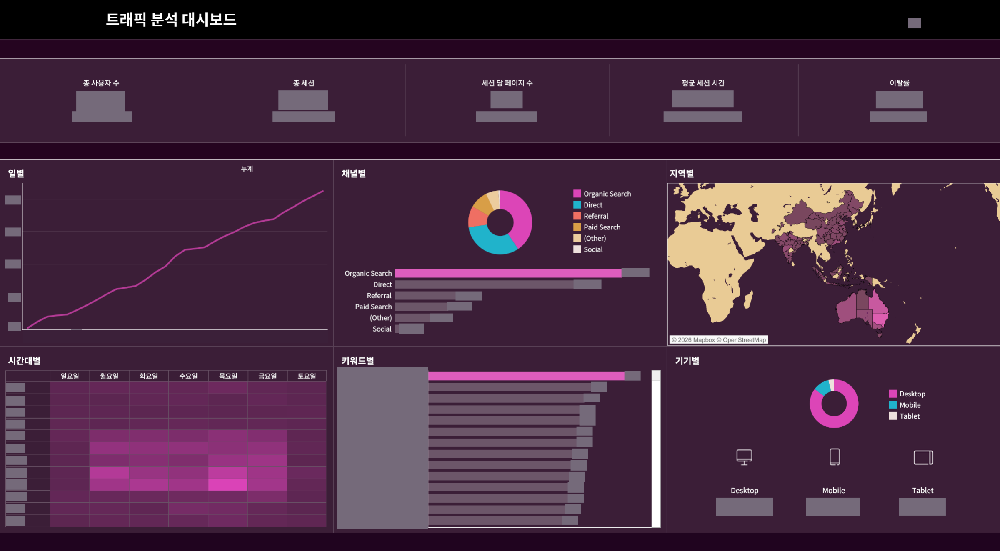

[← 프로필로 돌아가기](../../README.md)

# 대시보드 자료실

**손민우 · Tableau Dashboard Portfolio**

현업의 질문을 지표로 정리하고, 요약에서 상세까지 이어지는 화면을 만듭니다. 아래 카드를 선택하면 큰 이미지와 화면 구성 설명을 볼 수 있습니다.

> 회사명·로고·실제 수치·상품 및 업체 상세정보를 마스킹했습니다. 차트 형태와 배치는 화면 설명을 위해 유지했습니다.

<table>
<tr>
<td width="50%" valign="top">

<h3><a href="opex.md">01 · 운영비용 계획·집행 분석</a></h3>

계획과 실제 비용의 차이는 어디에서 발생했는가?

계획·실적 비교 / KPI 카드 / 상세 분석

</td>
<td width="50%" valign="top">

<h3><a href="traffic.md">02 · 서비스 트래픽 분석</a></h3>

방문자는 어디에서 유입되고, 어떻게 이용하는가?

행동 지표 / 채널 분석 / 히트맵

</td>
</tr>
<tr>
<td width="50%" valign="top">

<h3><a href="ads.md">03 · 광고비·매체 성과 분석</a></h3>

광고비는 어디에 쓰였고, 매체별 성과는 어떤가?

매체별 KPI / 비용 추이 / 성과 비교

</td>
<td width="50%" valign="top">

<h3><a href="cashflow.md">04 · 펀드·ETF 현금흐름 모니터링</a></h3>

운용자산의 변화는 어느 상품군에서 발생했는가?

기간 비교 / 분류별 탐색 / 상세 표

</td>
</tr>
</table>

## 화면에서 확인할 수 있는 것

| 관점 | 확인할 내용 |
| --- | --- |
| 지표의 우선순위 | 전체 상황을 먼저 파악할 수 있는 KPI 요약 |
| 비교 기준 | 기간·채널·항목별 차이가 드러나는 배치 |
| 분석의 흐름 | 요약에서 세부 항목과 상세 표로 이어지는 구성 |
| 표현 방식 | 목적에 맞춘 막대·선·도넛·히트맵·지도·표 활용 |

[상세 경력기술서 보기](../project-experience.md) · [프로필로 돌아가기](../../README.md)
