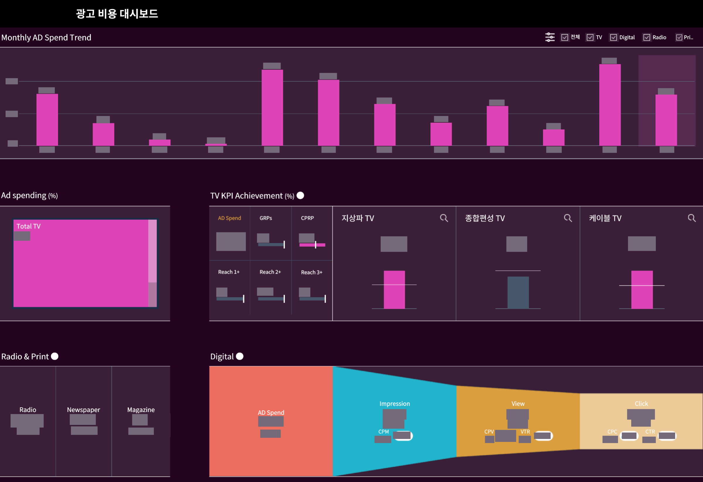

[← 자료실 전체 보기](README.md)

# 03 · 광고비·매체 성과 분석

**마케팅 성과 분석 샘플** · Tableau

> 광고비는 어디에 쓰였고, 매체별 성과는 어떤가?

월별 광고비와 매체별 집행 비중, TV 및 디지털 성과 지표를 한 화면에서 비교하는 구성입니다.

*이미지를 선택하면 큰 화면으로 볼 수 있습니다. 회사명·로고·실제 수치·상세정보는 마스킹했으며, 차트 형태와 배치는 유지했습니다.*

## 화면 구성

### 1. 기간별 집행 흐름

월별 광고비 추이를 상단에서 확인하고 매체별 집행 비중을 함께 비교합니다.

### 2. 매체에 맞는 지표

TV의 도달·성과 지표와 디지털의 노출·조회·클릭 지표를 구분해 보여 줍니다.

### 3. 요약에서 세부로

채널 선택과 매체별 영역을 통해 전체 비용과 세부 성과를 함께 읽을 수 있습니다.

**주요 구성:** 매체별 KPI / 비용 추이 / 성과 비교

---

[자료실 전체 보기](README.md) · [프로필로 돌아가기](../../README.md)
