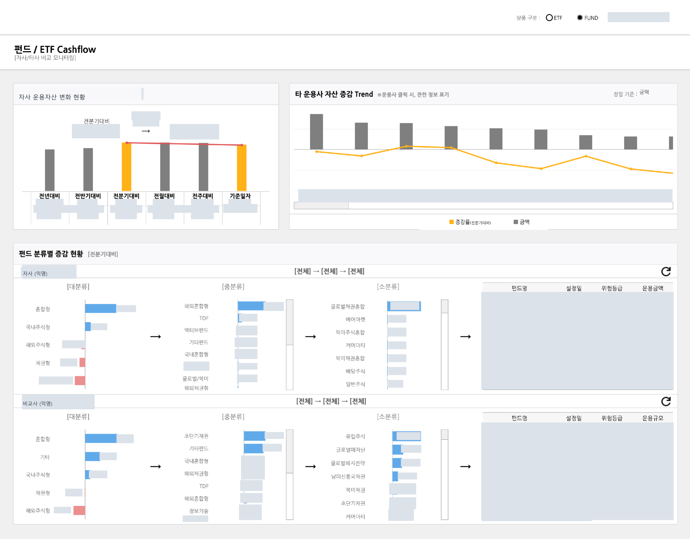

[← 자료실 전체 보기](README.md)

# 04 · 펀드·ETF 현금흐름 모니터링

**자산운용 모니터링 PoC** · Tableau

> 운용자산의 변화는 어느 상품군에서 발생했는가?

자사와 비교사의 자산 증감을 확인하고, 상품 분류와 개별 펀드 수준으로 내려가며 변화를 살펴보는 화면입니다.

*이미지를 선택하면 큰 화면으로 볼 수 있습니다. 회사명·로고·실제 수치·상세정보는 마스킹했으며, 차트 형태와 배치는 유지했습니다.*

## 화면 구성

### 1. 비교 기준의 명확화

전년·반기·분기·월·주 대비 변화를 같은 화면에서 확인합니다.

### 2. 상품 분류별 탐색

대분류에서 중분류·소분류로 좁혀 가며 자산 증감이 발생한 상품군을 살펴봅니다.

### 3. 요약과 상세의 연결

운용 규모와 증감률을 비교한 뒤 상세 표에서 개별 상품의 정보를 확인하는 구성입니다.

**주요 구성:** 기간 비교 / 분류별 탐색 / 상세 표

---

[자료실 전체 보기](README.md) · [프로필로 돌아가기](../../README.md)
