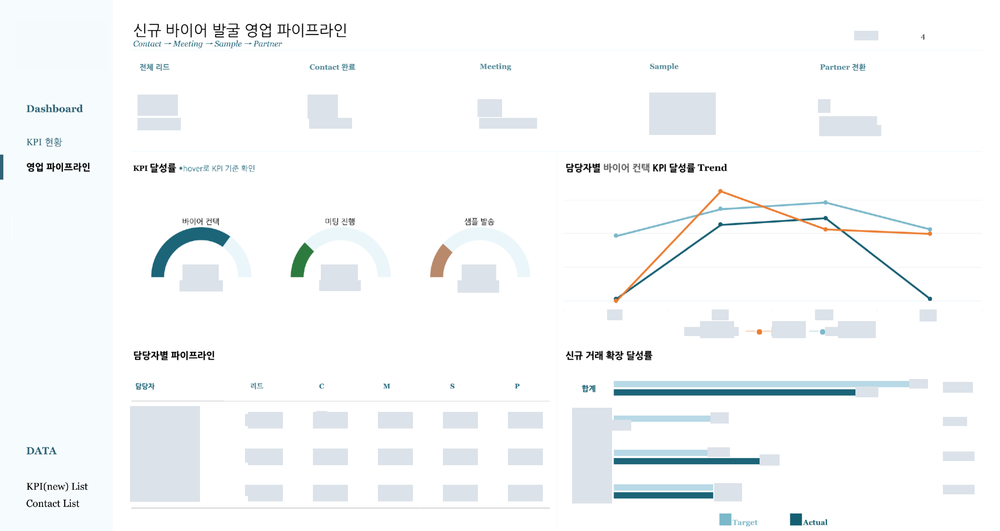

[← 자료실 전체 보기](README.md)

# 02 · 영업 파이프라인·전환 분석

**영업 분석 PoC · 디자인·개발 전담(100%) · 2026년 4월 조회** · Tableau

> 바이어 발굴은 어느 단계까지 진행되었는가?

대시보드 디자인과 개발을 전담했습니다. 리드에서 컨택·미팅·샘플·거래처 전환까지의 흐름을 정리하고, 단계별 달성률과 담당자별 현황을 비교하도록 구성했습니다.

*이미지를 선택하면 큰 화면으로 볼 수 있습니다. 회사명·로고·실제 수치·상세정보는 마스킹했으며, 차트 형태와 배치는 유지했습니다.*

## 화면 구성

### 1. 디자인·개발 전담

메뉴와 KPI 요약, 단계별 달성률, 담당자 비교 영역의 디자인과 개발을 직접 담당했습니다.

### 2. 진행 단계의 시각화

리드부터 거래처 전환까지의 현황을 상단에 두고, 단계별 KPI는 게이지로 표현했습니다.

### 3. 담당자별 비교

월별 달성률 추이와 담당자별 진행 현황을 함께 배치해 단계별 차이를 살펴봅니다.

**담당 역할:** 디자인·개발 전담 (100%)

2026년 4월로 조회한 화면의 상단 분석 영역입니다. 바이어 연락처 상세 목록은 제외했습니다.

**주요 구성:** 디자인·개발 100% / 단계별 KPI / 담당자 비교

---

[자료실 전체 보기](README.md) · [프로필로 돌아가기](../../README.md)
