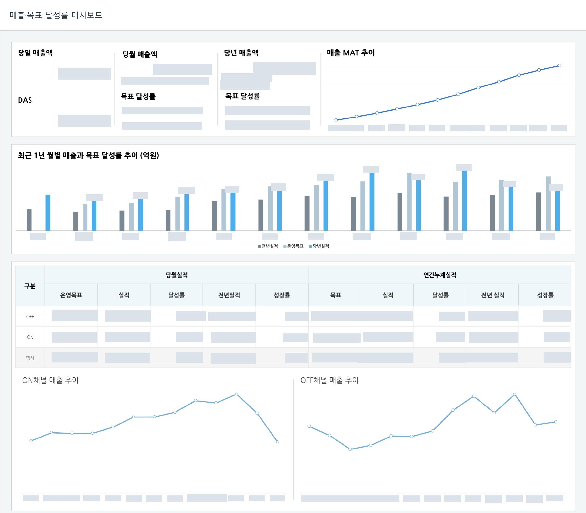

[← 자료실 전체 보기](README.md)

# 03 · 매출·목표 달성률 분석

**매출 분석 PoC · 대시보드 제작 전담(100%) · 상단 분석 영역 발췌** · Tableau

> 매출은 목표 대비 어느 수준이며, 채널별 차이는 무엇인가?

대시보드 제작을 전담했습니다. 일·월·연간 매출과 목표 달성률을 요약하고, 전년 실적과 채널별 추이를 함께 비교할 수 있도록 구성했습니다.

*이미지를 선택하면 큰 화면으로 볼 수 있습니다. 회사명·로고·실제 수치·상세정보는 마스킹했으며, 차트 형태와 배치는 유지했습니다.*

## 화면 구성

### 1. 대시보드 제작 전담

일·월·연간 매출과 목표 달성률을 한 화면에서 확인하는 대시보드 제작을 전담했습니다.

### 2. 동일 기준의 비교

전년 실적·운영 목표·당년 실적을 월별로 나란히 배치해 비교 기준을 맞췄습니다.

### 3. 채널별 흐름과 상세

ON·OFF 채널별 실적 표와 추이를 연결해 전체 매출의 차이를 세부적으로 살펴봅니다.

**담당 역할:** 대시보드 제작 전담 (100%)

매출과 목표 달성률 데이터가 표시된 기간의 화면입니다. 긴 대시보드 중 상단 요약·채널 분석 영역을 발췌했습니다.

**주요 구성:** 제작 100% / 목표·실적 비교 / 채널별 추이

---

[자료실 전체 보기](README.md) · [프로필로 돌아가기](../../README.md)
