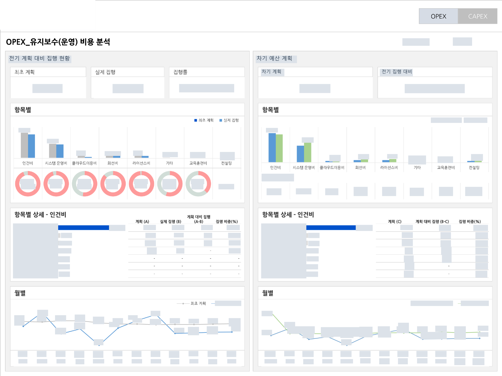

[← 자료실 전체 보기](README.md)

# 01 · 운영비용 계획·집행 분석

**금융권 비용 분석 PoC** · Tableau

> 계획과 실제 비용의 차이는 어디에서 발생했는가?

최초 계획, 실제 집행, 집행률을 먼저 확인하고 비용 항목과 월별 흐름으로 차이를 좁혀 보는 화면입니다.

*이미지를 선택하면 큰 화면으로 볼 수 있습니다. 회사명·로고·실제 수치·상세정보는 마스킹했으며, 차트 형태와 배치는 유지했습니다.*

## 화면 구성

### 1. 핵심 지표 요약

계획·집행·집행률을 상단에 배치해 전체 비용 현황을 먼저 파악합니다.

### 2. 항목별 비교와 상세

비용 항목별 막대·도넛 차트와 상세 표를 연결해 차이가 생긴 항목을 살펴봅니다.

### 3. 시간 흐름의 비교

월별 계획과 집행 추이를 함께 보여 특정 시점의 차이를 확인합니다.

**담당 역할:** 화면 구성 사례

**주요 구성:** 계획·실적 비교 / KPI 카드 / 상세 분석

---

[자료실 전체 보기](README.md) · [프로필로 돌아가기](../../README.md)
