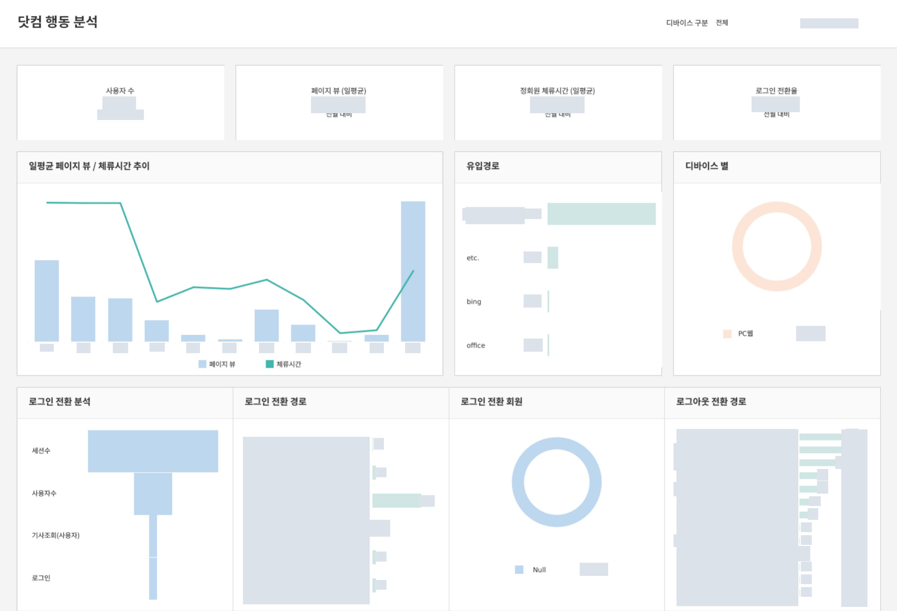

[← 자료실 전체 보기](README.md)

# 05 · 웹 행동·로그인 전환 분석

**참고 사례 · 제공된 통합 멤버십 사용자 매뉴얼 24~25쪽 발췌** · Tableau

> 어디에서 유입되어 어떤 행동을 거쳐 로그인하는가?

통합 멤버십 대시보드 사용자 매뉴얼에서 발췌한 웹 행동 분석 참고 화면입니다. 이용 지표, 유입 경로, 디바이스, 로그인 전환을 함께 살펴볼 수 있습니다.

*이미지를 선택하면 큰 화면으로 볼 수 있습니다. 회사명·로고·실제 수치·상세정보는 마스킹했으며, 차트 형태와 배치는 유지했습니다.*

## 화면 구성

### 1. 서비스 이용 지표

사용자 수, 일평균 페이지뷰, 체류시간, 로그인 전환율을 요약합니다.

### 2. 유입과 이용 환경

페이지뷰·체류시간 추이와 유입 경로·디바이스 분포를 함께 비교합니다.

### 3. 로그인 전환 흐름

세션·사용자·기사 조회·로그인 단계를 나누고, 로그인과 로그아웃 경로를 확인합니다.

**담당 역할:** 참고 사례

제공된 사용자 매뉴얼의 닷컴 행동 분석 화면 중 상단 지표와 로그인 전환 영역을 발췌했습니다. 본인 전담 제작 사례와 구분해 참고 자료로 수록했습니다.

**주요 구성:** 참고 사례 / 웹 행동 지표 / 로그인 전환

---

[자료실 전체 보기](README.md) · [프로필로 돌아가기](../../README.md)
